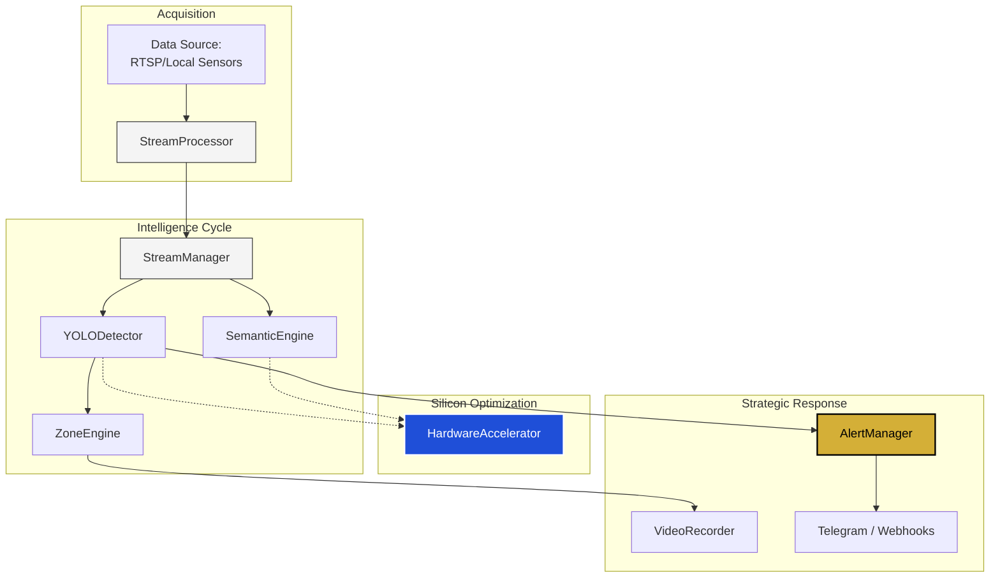

# Sentinel Core Architecture

This document outlines the sovereign engineering standards and system flow of the Sentinel Core engine.

## Operational Overview

## System Flow

1.  **Ingestion Layer**: `camera.processor.StreamProcessor` handles the asynchronous acquisition of video frames from technical sources (RTSP, local sensors).
2.  **Logic Layer**: `core.manager.StreamManager` orchestrates the assignment of AI detectors to active streams.
3.  **Intelligence Layer**: `ai.detector.YOLODetector` executes high-throughput inference on incoming frames.
4.  **Spatial Layer**: `ai.zone.ZoneEngine` verifies situational awareness data against strategic boundaries.
5.  **Semantic Layer**: `ai.semantic.SemanticEngine` encodes frames into a sovereign vector space for natural language querying.
6.  **Acceleration Layer**: `core.accelerator.HardwareAccelerator` optimizes computational throughput across NVIDIA and Apple Silicon.

## Strategic Principles

- **Zero-Latency Design**: Every component is built for real-time mission-critical response.
- **Asynchronous Orchestration**: Native `asyncio` support for massive scale-out surveillance.
- **Agnostic Processing**: Built as a foundational layer that can wrap any industrial AI model (YOLO, CLIP, etc.).

---
© 2026 AB Labs.
