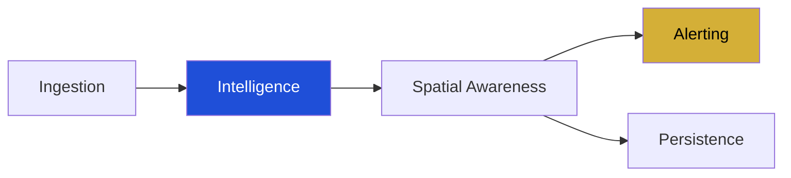

# Sentinel Core

<p align="left">
  
  
  
  
</p>

**The Mission-Critical Surveillance Framework.**

Sentinel Core is the open-source foundational layer of the Sentinel platform. It provides the architectural primitives required for high-performance, autonomous video intelligence, object detection, and multi-stream camera management.

This core library is maintained by **AB Labs** and is engineered for environments where reliability and low-latency processing are non-negotiable.

---

## Strategic Pipeline



## High-Level Architecture

Sentinel Core is designed as a modular pipeline:

1.  **Ingestion**: Multi-protocol stream handling (RTSP, RTMP, Local).
2.  **Detection**: Abstraction layers for AI model inference (YOLO, CLIP, Custom).
3.  **Intelligence**: Data-schema for persistent tracking and situational awareness.
4.  **Spatial Awareness**: Polygon-based zone detection, intrusion alerts, and loitering analysis.
5.  **Semantic Search**: Natural language querying of technical data streams via sovereign CLIP embeddings.
6.  **Sovereign Alerting**: Standardized protocols for secure alert delivery via Telegram, Webhooks, and custom channels.
7.  **Evidence Persistence**: High-fidelity video recording with pre-event buffering and automated segment management.
8.  **Hardware Acceleration**: Silicon-aware optimization for NVIDIA CUDA and Apple Silicon (MPS).
9.  **Sovereign Memory**: Institutional-grade persistence for detections and alerts via local SQLite substrate.

## Getting Started

Sentinel Core is designed to be highly extensible. Below is a minimal implementation of a custom situational awareness detector:

```python
from ai.base import BaseDetector, Detection
from core.manager import StreamManager

class CustomUnitDetector(BaseDetector):
    def detect(self, frame):
        # Implementation of your AI model inference logic
        return [
            Detection(class_id=0, class_name="person", confidence=0.98, bbox=(0.1, 0.1, 0.5, 0.5))
        ]

# Initialize the Orchestrator
manager = StreamManager()
manager.set_detector(CustomUnitDetector())

# Initiate a stream session
import asyncio
asyncio.run(manager.start_stream(camera_id=101, source="rtsp://internal.secure-feed.local/stream1"))
```

## Progressive Evolution

Sentinel Core is a living framework. We push technical updates and architectural refinements as they are validated through our ongoing strategic deployments. Our goal is to maintain a continuous stream of progress:

- **v0.1.0** (Feb 2026): Core Schema & AI Abstraction Interfaces.
- **v0.2.0** (Feb 2026): Functional Stream Processing & Native Intelligence wrappers (YOLO).
- **v0.2.1** (Feb 2026): Sovereign Semantic Search via CLIP embeddings.
- **v0.4.0** (Feb 2026): Strategic Response (Alerting) & Evidence Persistence (Recording).
- **v0.5.0** (Feb 2026): Silicon-Aware Hardware Acceleration (CUDA/MPS).
- **v0.6.0** (Feb 2026): Sovereign Memory (Persistent SQLite Archive).
- **In-development**: Distributed indexing, GPU-accelerated inference, and autonomous alerting protocols.

---

## Philosophy

Surveillance is not just about recording video; it's about **autonomous situational awareness.** Sentinel Core provides the schemas that transform raw pixels into strategic data.

© 2026 [AB Labs](https://github.com/abg-labs) • Strategic Systems Engineering.
